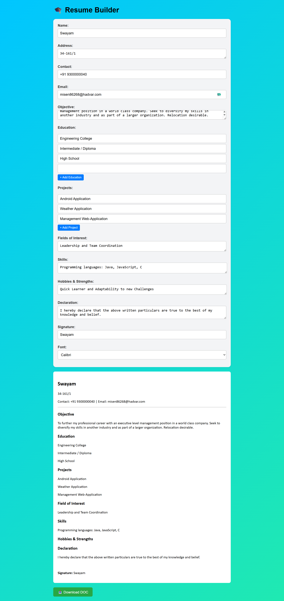

# Online Resume Builder

A simple and customizable **React-based Resume Builder** that allows users to:

- Enter personal and professional details
- Dynamically add multiple Education and Project entries
- Choose between different fonts (Calibri, Arial, Times New Roman)
- View real-time resume preview
- Export the resume to a `.doc` (Word) file

---

## Features

- Basic Canva-style form UI with colorful gradient background
- Add multiple **Education** and **Projects** fields dynamically
- Input fields for:
  - Name
  - Email
  - Address
  - Contact
  - Career Objective
  - Education (multiple)
  - Projects (multiple)
  - Fields of Interest
  - Skills
  - Hobbies & Strengths
  - Declaration
  - Signature
- Font selector (Calibri / Arial / Times New Roman)
- Download as Word `.doc` format

---

## Screenshots



---

## Tech Stack

- **Frontend**: React + Vite.js
- **Styling**: CSS (Flexbox, gradients, custom buttons)
- **Export**: Uses `html-docx-js` or `FileSaver` for generating `.doc` files (optional)

---

## Installation

```bash
git clone https://github.com/swayamprakashm/online-resume-builder.git
cd online-resume-builder
npm install
npm run dev
````

---

## Folder Structure

```
src/
├── components/
│   ├── ResumeForm.jsx
│   └── ResumePreview.jsx
├── App.jsx
├── main.jsx
├── Form.css
└── index.css
```

---

## Author

**M Swayam Prakash**

[https://github.com/swayamprakashm](https://github.com/swayamprakashm)

---

## License

This project is licensed under the MIT License.

```
